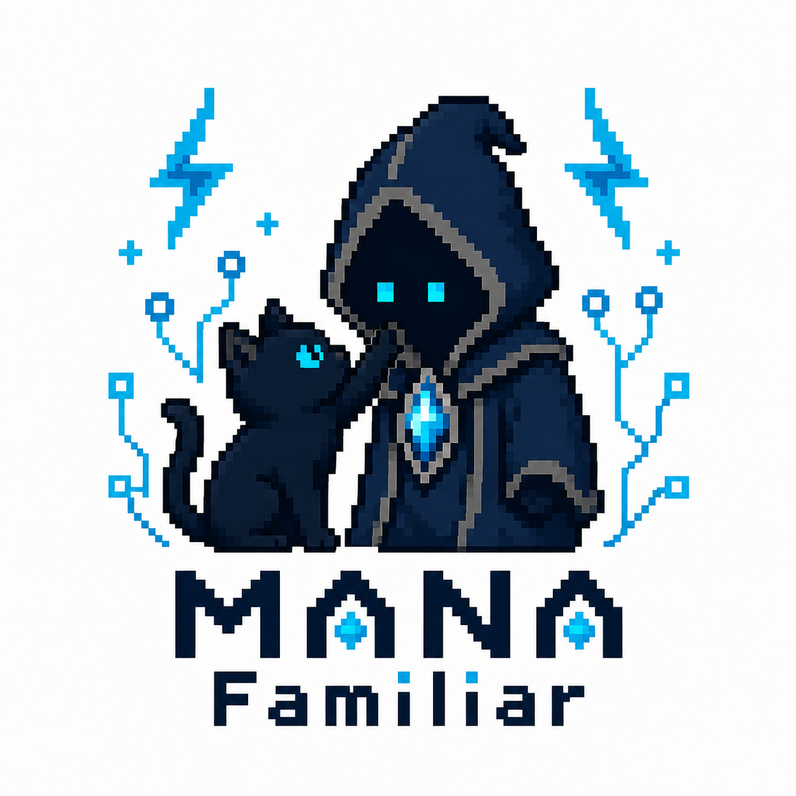

<p align="center">
  
</p>

# Mana Familiar

Mana Familiar is the read-only desktop **project observatory** for Mana. It
presents Mana-owned work items, project context, review state, activity, and
documents without reconstructing semantics from files or Markdown.

See the [product boundary](docs/product-boundary.md) for the read-only client
scope and the versioned-contract direction.

Mana is the producer and owns all inspect semantics. This repository is the
typed consumer and presentation layer. The normal Observatory path invokes
only advertised `mana inspect` operations and does not scan `.mana`, call a
model, use the network, or write the inspected project. The standalone legacy
Journey explorer remains an explicit compatibility surface.

## Development

Requirements: Flutter with macOS desktop support. A Mana checkout or
installation is required only for producer-backed mode; direct artifact mode
works with this repository alone.

### Open a materialized artifact directly

Any compatible `mana.learning.graph/v1` JSON artifact can be opened read-only
without installing Mana:

```sh
flutter pub get
flutter run -d macos \
  --dart-entrypoint-args=--artifact \
  --dart-entrypoint-args=/path/to/materialized-journey.json \
  --dart-entrypoint-args=--project-root \
  --dart-entrypoint-args=/path/to/source-project
```

`--project-root` is optional when no source anchors need to be resolved.
Diagram paths in the artifact are resolved relative to the artifact directory.
`--fixture` remains a backwards-compatible alias for `--artifact`.
Artifact-derived source and diagram paths are containment-checked before any
file is read; see [Artifact compatibility](docs/artifact-compatibility.md).

### Use a Mana producer installation

```sh
flutter pub get
flutter run -d macos \
  --dart-entrypoint-args=--project-root \
  --dart-entrypoint-args=/path/to/target-project \
  --dart-entrypoint-args=--mana-root \
  --dart-entrypoint-args=/path/to/mana
```

`--project-root` identifies the read-only target project. `--mana-root`
identifies a compatible Mana producer; it need not be a sibling checkout.
Supplying both flags is the portable invocation. Familiar negotiates the exact
inspect schemas before loading optional surfaces.

### Human Feedback su artefatti pubblicati

Quando Mana dichiara la capability `human-feedback`, Familiar può inviare
commenti, risposte e decisioni Story Start con richieste JSON strutturate. Il
client conserva soltanto bozze locali: non scrive Markdown generato né file
`.mana` direttamente. Mana convalida identità, revisione e alternative prima
di pubblicare il contributo canonico. Una decisione registrata richiede una
successiva ripianificazione; non approva né avvia un provider.

### Open a saved Mana inspect response

For standalone demos or testing of the project read model, open a saved
versioned Mana inspect response without a Mana checkout:

```sh
flutter run -d macos \
  --dart-entrypoint-args=--inspect-snapshot \
  --dart-entrypoint-args=/path/to/mana-inspect-response.json
```

The inspect client negotiates project capabilities before optional operations;
see [Mana inspect compatibility](docs/mana-inspect-compatibility.md).

## Project-observatory flow

1. **Overview** shows typed attention, relevant work, project context, and
   recent producer-ordered activity.
2. **Work** opens a persistent work-item dossier with Overview, Requirements,
   Plan, Decisions, Evidence, Review, and Timeline.
3. **Reviews**, **Knowledge**, and **Activity** are semantic cross-project
   surfaces. Documents open in Reader, Source, and Metadata modes while keeping
   their work-item or project-context parent.
4. **Advanced** contains the raw artifact catalog and inspect diagnostics.
   Legacy catalog classification is isolated from semantic modes.

Screenshot placeholders are intentionally retained until a human reviews
captures from a non-sensitive project. The application has no telemetry and
the repository does not ship example customer artifacts.

Run the complete validation suite with:

```sh
dart format --output=none --set-exit-if-changed .
flutter analyze
flutter test
flutter build macos --debug
```

For synthetic task screenshots and optional agentic visual evaluation of
readability, information hierarchy, and misleading states, see
[UX evaluation](docs/agentic-ux-testing.md).

The optional UX evaluator is informational only. Its local synthetic captures do
not open projects, call a model unless explicitly requested, or turn an agent
judgment into a CI gate.

### Cross-repository zero-token harness

With a compatible local Mana checkout, C01 creates a temporary project,
bootstraps it through Mana's supported path, and proves the resulting inspect
contracts load in Familiar twice without model or network access:

```sh
tests/run-c01-zero-token-harness.sh --mana-root /path/to/mana
```

The runner rejects a missing or wrong Mana repository instead of silently
skipping. It removes its temporary project on completion.

F16 adds the broader semantic acceptance harness. It creates empty, context,
feature, session, full-semantic, and hostile temporary projects; exercises all
eight inspect operations; validates deterministic/no-write output; disables
provider commands; and runs the real responses through the Familiar client:

```sh
tests/run-c02-semantic-observatory-harness.sh --mana-root /path/to/mana
```

Run the producer/consumer contract gate from the Mana checkout with:

```sh
scripts/verify-inspect-consumer-compatibility.sh \
  --familiar-root /path/to/mana-familiar
```

### C03 Human Feedback

C03 esercita il producer reale su progetti temporanei, con replay idempotente,
reply concorrenti sulla stessa revisione, conflitti e letture canoniche. Non
usa provider o rete. Il report, la trace e le revisioni dei due checkout sono
salvati in `build/feedback-audit/run-*`.

```sh
python3 tests/run-c03-human-feedback-harness.py \
  --mana-root /path/to/mana --profile smoke
```

Il profilo `stress` è intenzionalmente separato (5 seed × 2.000 azioni) e ha
un workflow schedulato/manuale. I profili `desktop-long` (300 mutazioni
distribuite su 20 minuti) e `soak` (1.000 su 60 minuti) hanno gate producer
dedicati e reportano esplicitamente il proprio scope. Nessuno dei tre
sostituisce l'E2E nativo desktop: finestre, riavvii, rigenerazioni e metriche
UI richiedono prove native dedicate.

Su macOS il gate nativo delle finestre e del lifecycle è:

```sh
flutter build macos --debug
tests/run-macos-native-window-e2e.sh
```

Avvia due processi Runner reali, verifica il focus in entrambe le direzioni,
poi esercita Close e Quit tramite menu nativi per PID. Richiede il permesso Accessibility per il
terminale che esegue il comando; conserva l'evidenza in `build/native-e2e/`.
Familiar non avvia un provider dalla UI. Le rigenerazioni restano esterne e
il gate nativo verifica che finestre, focus e lifecycle rimangano corretti
mentre Mana pubblica nuove versioni; l'asserzione semantica sui collegamenti
dei target resta nel contratto Mana/Familiar.

Con il checkout Mana compatibile, lo smoke nativo pubblica V0/R1–R5 con la
pipeline Story Start v2 e conserva un manifest completo. In debug usa un
bridge loopback limitato ai widget montati per selezionare un target stabile,
pubblicare un commento e una risposta e verificarne il thread nella UI e in
Mana; non è un input Accessibility. Focus e lifecycle restano azioni macOS
reali. Dopo ogni rigenerazione il gate attende la revisione esatta esposta dal
documento UI:

```sh
python3 tests/run-native-feedback-e2e.py --mana-root /path/to/mana
```

La registrazione di una decisione ha uno smoke separato, perché la scelta
impone una ripianificazione governata: la fixture deterministica R1–R5 non
proietta ancora la scelta nel successivo decision register. Il profilo verifica
la scelta nella form UI e nello stato canonico Mana, oltre a focus e lifecycle,
senza presentare una rigenerazione successiva come prova valida:

```sh
python3 tests/run-native-feedback-e2e.py --mana-root /path/to/mana --profile decision-smoke
```

Le bozze hanno a loro volta uno smoke separato su due Runner e sullo stesso
target: crea testi distinti, invia Close e Quit entro il debounce di 350 ms,
poi ne verifica il ripristino locale senza scritture canoniche involontarie.

```sh
python3 tests/run-native-feedback-e2e.py --mana-root /path/to/mana --profile draft-smoke
```

Il profilo nativo `desktop-long` distribuisce 300 azioni dei widget montati
su almeno 20 minuti, alternando commenti e risposte tra due finestre reali.
Intercala cinque rigenerazioni Story Start, tre restart nativi con nuovi PID
e dieci episodi recuperabili: due conflitti, due ACK persi, due letture
fallite, due scritture bozza fallite e due risposte ritardate. Le evidenze
verificano errori e recuperi dalla UI e i conteggi canonici Mana; sondaggi e
attese non sono contati come azioni. I fault usano un wrapper nel solo
progetto sintetico e lo storage delle bozze resta temporaneo.

```sh
python3 tests/run-native-feedback-e2e.py --mana-root /path/to/mana --profile desktop-long
```

Il report finale richiede tutte le 300 azioni, R1–R5, tre restart e dieci
recuperi; evidenza incompleta produce failure. Il bridge resta
`flutter-widget-bridge`, con focus e Close/Quit macOS reali tramite i menu
File e applicazione indirizzati per PID, senza tasti globali. Questa prova
legge i widget dopo un frame di build/layout richiesto dal bridge anche nelle
finestre occluse; non certifica la consegna dei pixel a schermo. La build
debug non certifica le soglie prestazionali delle build profile, il gate
Windows, il soak o la decisione seguita da ripianificazione governata.

## Contract

The Observatory supports the eight `mana.inspect.* /v1` schemas documented in
[Mana inspect compatibility](docs/mana-inspect-compatibility.md). The
standalone Journey explorer separately supports `mana.learning.graph/v1` under
the rules in [Artifact compatibility](docs/artifact-compatibility.md).
Unsupported schema versions are rejected rather than guessed.

Producer-backed mode consumes the deterministic materialization emitted by
`scripts/mana-journey.sh materialize`, plus the documented concept-label and
expansion request commands. See the
[consumer architecture note](docs/architecture.md) for the boundary.

## Development fixture

For the repository's deterministic branching/cycle fixture:

```sh
flutter run -d macos \
  --dart-entrypoint-args=--artifact \
  --dart-entrypoint-args=test/fixtures/complex_journey_fixture.json
```

The fixture is materialized Journey JSON and never persists data under `.mana`.

## Supported platforms

macOS and Windows desktop are supported application targets. Web scaffolding
is retained for possible future work, but browser runtime is not supported
because inspect processes and explicitly requested local source/editor
integration require desktop APIs.

## Local packaging and release review

See [release readiness](docs/release-readiness.md) for source and ad-hoc local
build steps, automated release artifacts, the future Developer
ID/notarization sequence, the compatibility matrix, and known limitations.

## License

Mana Familiar is available under the [MIT License](LICENSE).
